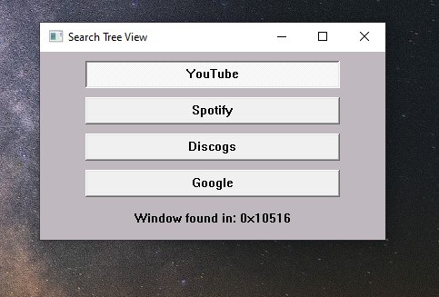
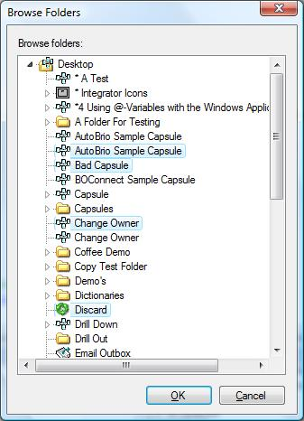
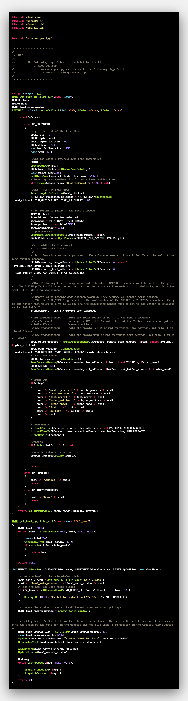
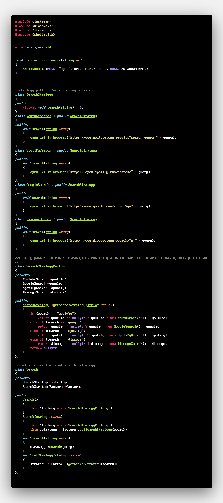

In April 2020, I have long spoke about my magnum opus of my programming life, and that was getting the data of a Tree View Item on a Windows Desktop app, then doing a search on it.

I explained more about that here.

https://mmulcahy222.github.io/#windowsapi_treeview_search

It was done in here. I wanted to add more to it. I wanted to achieve the following objectives.

1) Beef up my C++ skills by porting a Python application to C++. Also, it's easier to explore Win32 API using C++ than with Python, now that I'm better at mastering C++ workflows.

2) Make a far far superior & snappier application that's actually a pleasure to use, and opens "snappily" in milliseconds.

3) Work on making menus & pop-ups & buttons & controls & my very first ever Windows GUI application!!!! It only took me this long as a software engineer.

4) I knew this was going to be needing some design patterns & architectural design, and it was a pleasure to do this in a difficult language like C++. I never did the strategy pattern beforee. The strategy design pattern was what I had in mind, and I wound up mixing the Factory design pattern with the Strategy design pattern for efficiency. This factory returns singletons, because it would be madness to keep on instantiating new Strategy objects when they are all the damn same, and I feel my implementation of that is pretty great and love it.

I give to you.... this!

If you click on a tree view item like this, it will do a web search on the text of the tree view that's clicked on. 

The program starts in search_gui.cpp, and that imports windows_gui.hpp, and windows_gui.hpp in turn imports search_strategy_factory.hpp. There could have been a better way of arranging all of this with #IFDEF and so on, but I am absolutely NOT a guru at C++ at this time when it comes to this, coming from Python & PHP and abstract easy languages. The program works, though, LOL. I am fine with a better way however, and in the real world will do what's best practice.

As a result of porting the April 2020 Python project into C++ with a GUI interface, the program is usable & beautifully efficient & workable. It leverages the strategy design pattern, and the strategy objects are decoupled with the Factory design pattern which you can find in search_strategy_factory.cpp. Many people said that Factories should always return "new" objects each time, but I'm not down with that, if you have a good explanationa as to why, tell me and I will look into it, but I like it this way.

Just like in the April 2020 project, the key WinAPI functins to retrieve the Tree View Data via Process Memory injection are

| Kernel32.dll API function | Purpose |
| ------ | ------ |
| WriteProcessMemory | (Puts OUR local TVITEM object into the remote process)
| SendMessageA       | (message is TVM_GETITEM, and fills out the TVItem structure we put in)
| GetLastError       | (error checking)
| ReadProcessMemory  | (gets the remote TVITEM object at remote_item_address, and puts it in local &item)
| ReadProcessMemory  | (gets the remote text object at remote_text_address, and puts it in local &buffer)

# search_gui.cpp

# windows_gui.hpp

# search_strategy_factory.cpp

